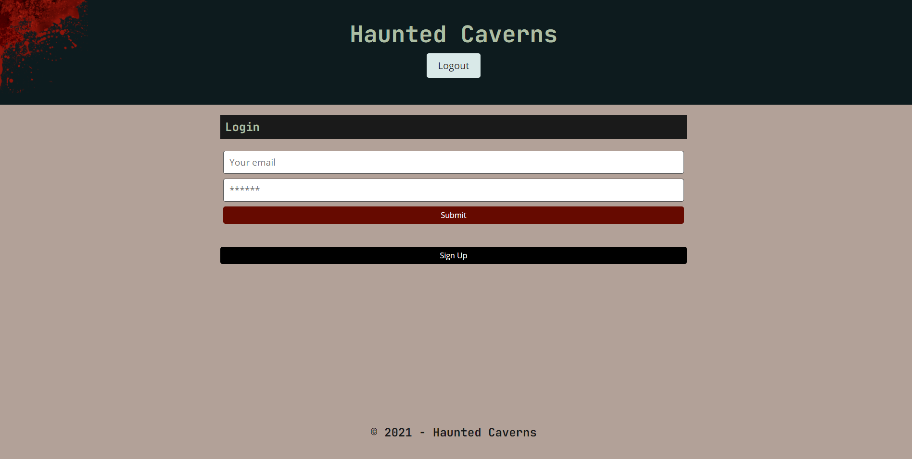
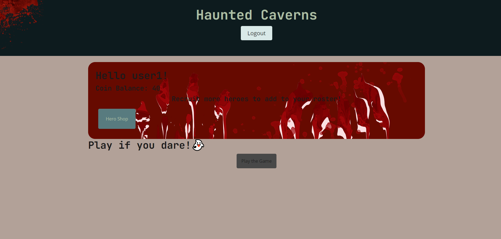
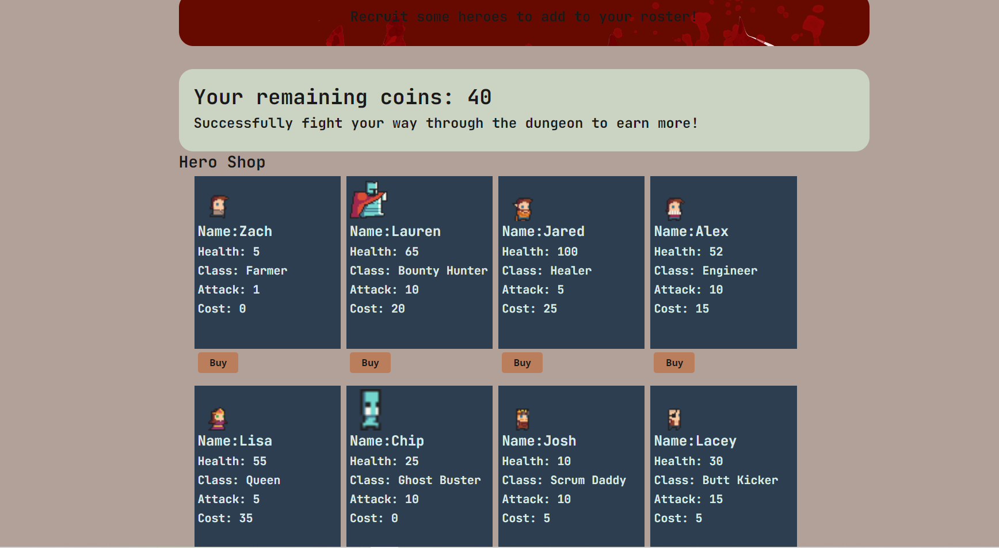
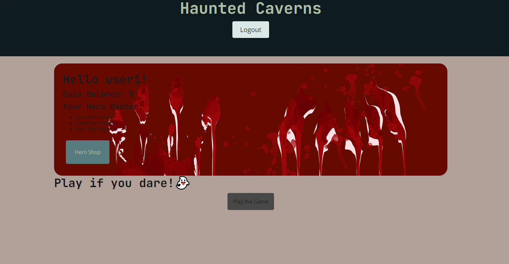
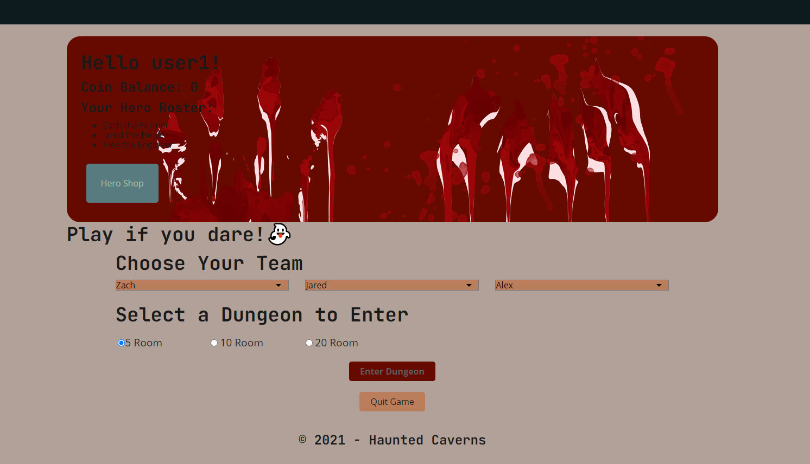
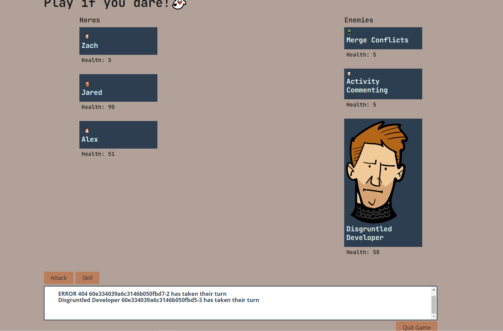
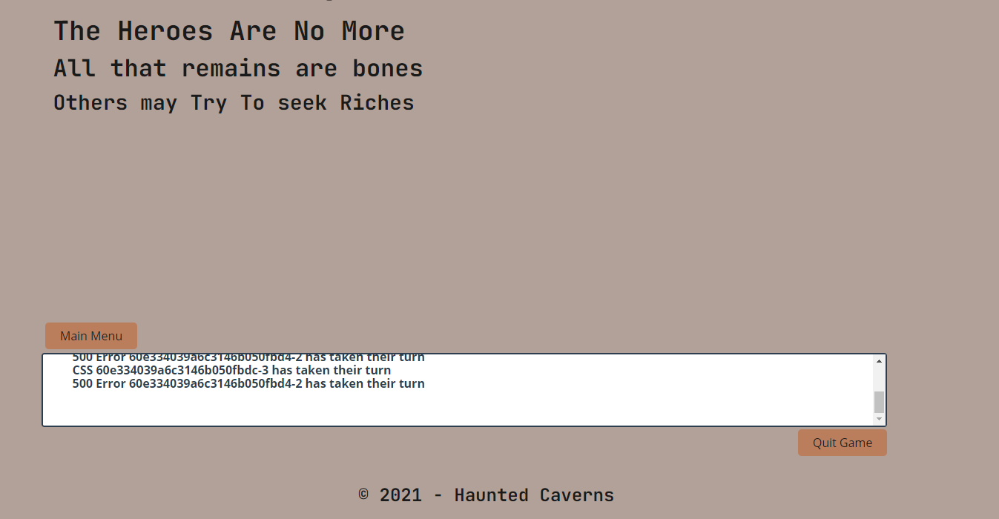
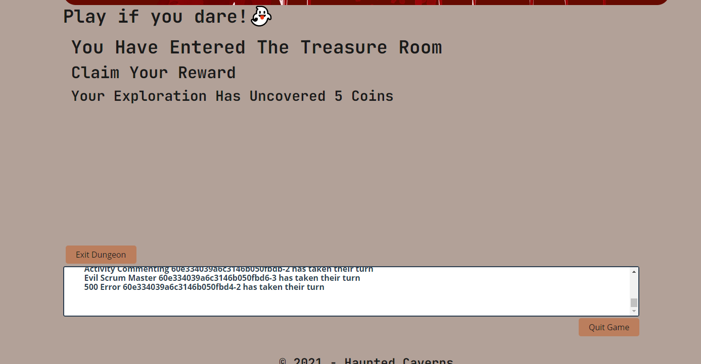

# React_Adventure_Game

## Description

This is a full-stack MERN web application. It's a turn-based game that allows the player to test their abilities against the enemy infested dungeon. Each successfully completed room will reward loot but BEWARE, if your team of brave hero's perish, there will be consequences to pay!

## Table of Contents

- [Links](#links)
- [Usage Information](#usage-information)
- [Contributors](#contributors)
- [License](#license)
- [Features](#features)
- [Image Credits](#credits)

## Links

[Deployed Application](https://dry-mountain-02487.herokuapp.com/)  
[GitHub Repository](https://github.com/Ajurgs/React_Adventure_Game)

## Usage Information

You must first sign-up to create a profile. You will be redirected to '/me' where you will be able to navigate to the character shop and purchase new hero's! You will also be able to click the 'Play' button in order to start the game.

## Contributors

- [Alex Jurgs](https://github.com/Ajurgs)
- [Zach Raab](https://github.com/zachraab)
- [Lauren Gabaldon](https://github.com/lauren-gabaldon)
- [Lisa Barton](https://github.com/lisabarton23)
- [Jared Sutch](https://github.com/JaredWilliam97)

## Image Credits
-[Superdark 16x16-free-npc-pack](https://superdark.itch.io/16x16-free-npc-pack)
-[Superdark enchanted-forest-characters](https://superdark.itch.io/enchanted-forest-characters)
-[0x72 dungeontileset-II](https://0x72.itch.io/dungeontileset-ii)
-[AnriTool cr-tileset](https://anritool.itch.io/cr-tileset)
## License

MIT

## Features

- user authentication
- persistent data
